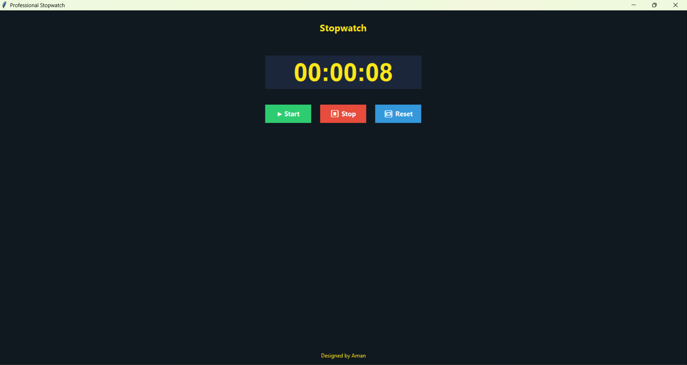

# ⏱️ Stopwatch Using Tkinter

## 📖 Overview
The **Stopwatch** is a modern and minimalistic time-tracking application developed using **Python Tkinter**.  
It provides users with start, stop, and reset functionalities to measure elapsed time accurately.  
Designed with a clean interface and smooth button controls, it’s perfect for students, professionals, or developers practicing time-based tasks.

---

## 🚀 Features
- ▶️ **Start**, ⏸️ **Pause**, and 🔄 **Reset** options  
- 🕒 Displays real-time elapsed time  
- 🎨 Professional and responsive Tkinter interface  
- ⚙️ Accurate and lightweight performance  
- 💡 Easy to use and customizable  

---

### Output

---

## 🧰 Tech Stack
- **Language:** Python  
- **Library:** Tkinter  

---

## ⚙️ Installation and Setup
1. Clone this repository:
   git clone https://github.com/amanchougule09/Stopwatch-using-TKinter.git
   
2. Navigate to the project folder:
  cd Stopwatch-using-TKinter

3. Run the application:
  python Stopwatch.py

💡 Use Case
Useful for:
Tracking coding or study sessions
Measuring workout durations
Testing app performance or delays

👨‍💻 Author
Aman Chougule
